<h1 align="center">Career Toolkit</h1>
<p align="center">Agent Skill — 用对话代替表单，从职业规划到简历生成一步到位。</p>

<p align="center">
  
  
  
</p>

## 主题画廊

11 套主题，每套有头像/无头像两版，支持口头微调。

<table>
<tr>
<td align="center">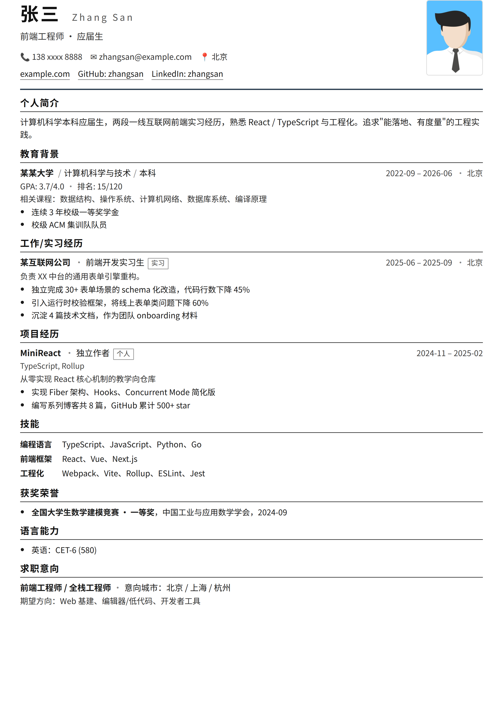<br/><b>Classic</b></td>
<td align="center">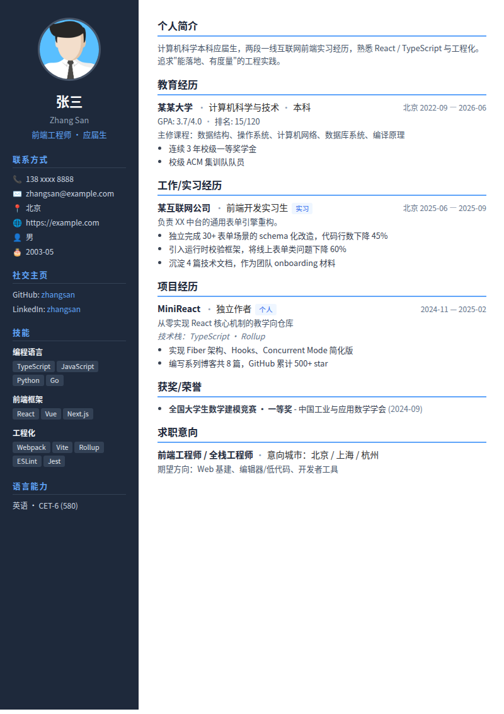<br/><b>Modern</b></td>
<td align="center">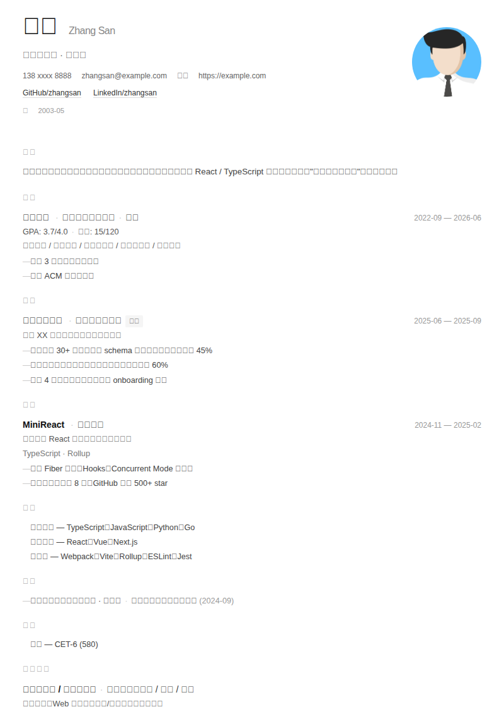<br/><b>Minimal</b></td>
</tr>
<tr>
<td align="center">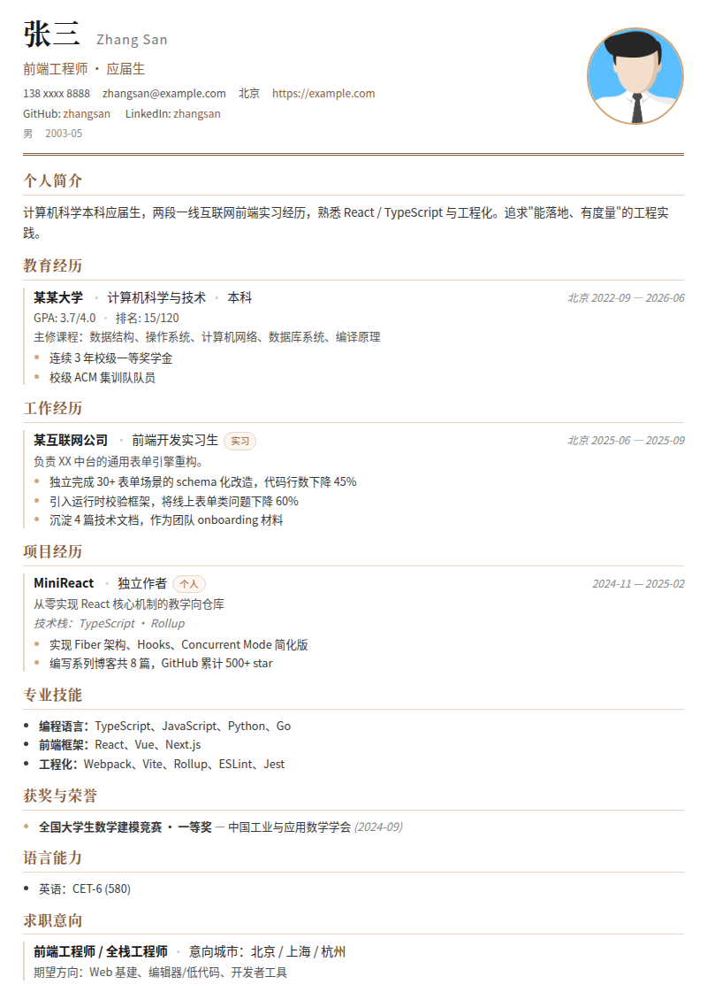<br/><b>Elegant</b></td>
<td align="center">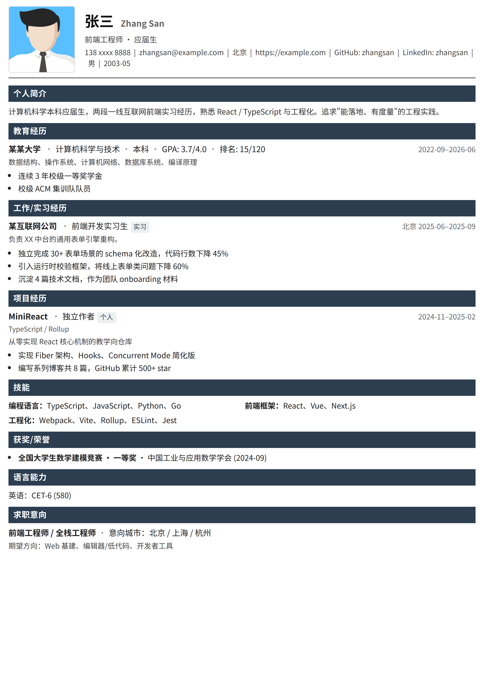<br/><b>Compact</b></td>
<td align="center">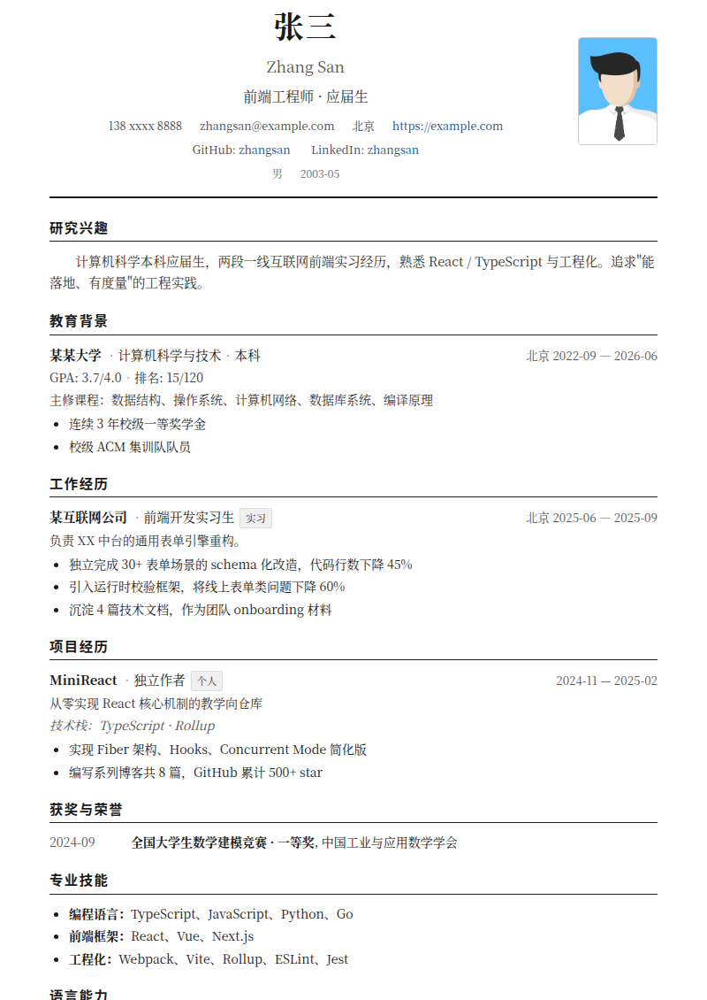<br/><b>Academic</b></td>
</tr>
<tr>
<td align="center">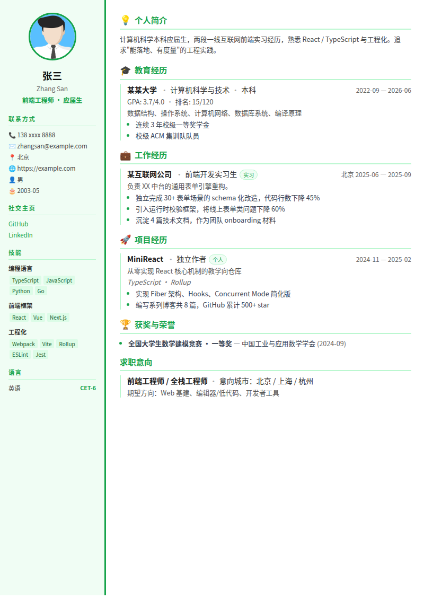<br/><b>Infographic</b></td>
<td align="center">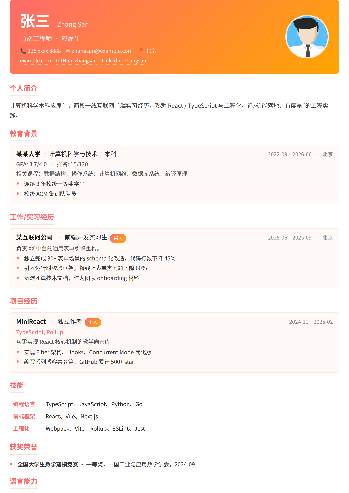<br/><b>Creative</b></td>
<td align="center">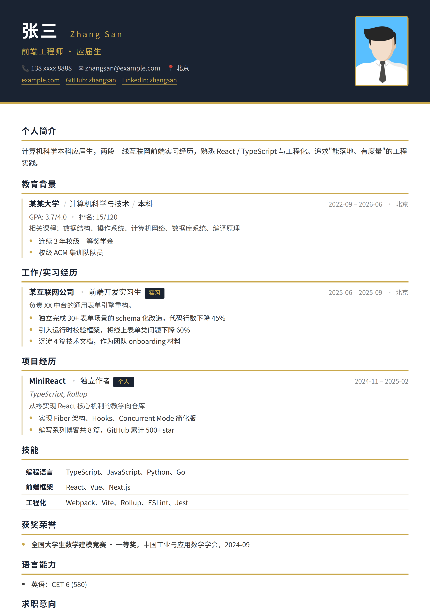<br/><b>Executive</b></td>
</tr>
<tr>
<td align="center">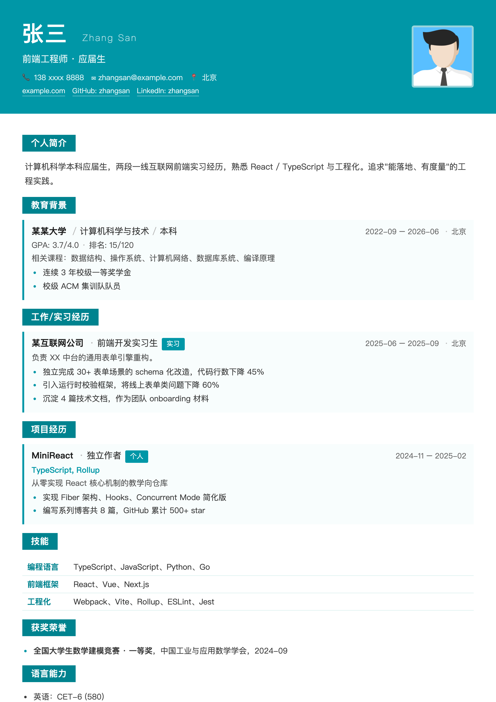<br/><b>Metro</b></td>
<td align="center">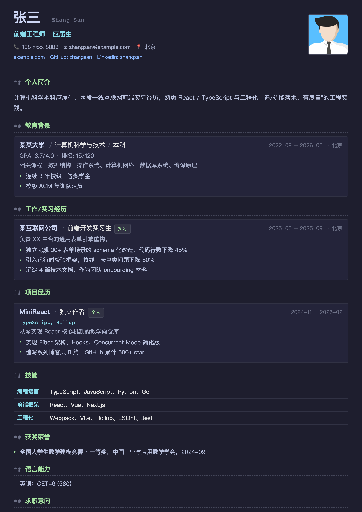<br/><b>Tech</b></td>
<td></td>
</tr>
</table>

---

## 工作原理

```
       ┌─────────────────────────────────────────────────┐
       │              Career Toolkit                      │
       │                                                 │
       │   ① Planner    ② Builder      ③ Optimizer      │
       │   ┌────────┐   ┌──────────┐   ┌────────────┐   │
       │   │ 画像   │   │ 对话挖掘 │   │ JD 关键词  │   │
       │   │ 测评   │──→│ YAML生成 │──→│ ATS 检查   │   │
       │   │ 规划   │   │ 主题渲染 │   │ Bullet改写 │   │
       │   └────────┘   └──────────┘   └────────────┘   │
       │                                                 │
       │   profile.yaml → resume.yaml → 匹配报告         │
       └─────────────────────────────────────────────────┘
```

- **Career Planner** — 引导式提问 + Holland 测评，产出职业规划和行动时间线
- **Resume Builder** — 对话挖掘经历 → YAML → 选主题渲染（HTML/PDF/Markdown/JSON Resume）
- **Resume Optimizer** — 给 JD 算覆盖率、ATS 合规检查、逐条 Bullet 改写

---

## 安装

跟 Agent 说：

```
帮我安装这个 skill: https://github.com/<your-username>/career-toolkit
```

<details>
<summary>手动安装</summary>

```bash
git clone https://github.com/<your-username>/career-toolkit.git ~/.trae/skills/career-toolkit
pip install pyyaml jinja2 jsonschema
pip install weasyprint  # 可选，PDF 导出
```
</details>

---

## 技术实现

| 层 | 技术选型 |
|---|---|
| 数据层 | YAML + JSON Schema 校验 |
| 渲染层 | Jinja2 模板 + 纯 CSS |
| 导出层 | WeasyPrint / Markdown / JSON Resume |
| 测评层 | Python + YAML 题库 |
| 优化层 | 关键词提取 + 规则引擎 |

全离线，不依赖外部 API。模块间通过文件解耦，可单独使用。

---

## License

MIT
